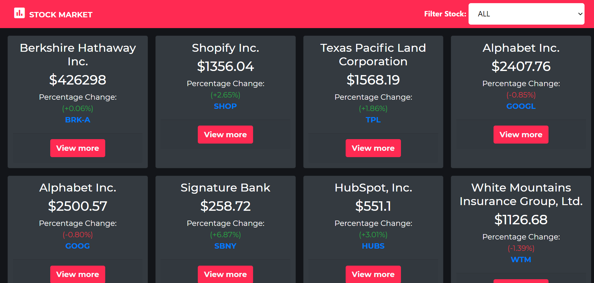
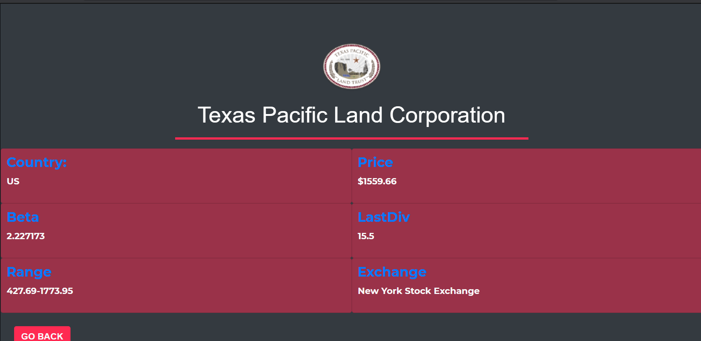

# FINANCIAL STOCK (CATALOGUE OF STATISTICS)

In this project I created a catalogue of financial statistics for various companies using data fetched from financial modelling prep API. One can also filter data to see either the Gainers or Losers in the market.

See Live version of app [here](https://rose-financial-stock.herokuapp.com/) 

### Stock Page

### Company Page

## Built With

- Node.js
- React
- React-DOM
- React-Create-App
- Redux
- npm
- CSS
- ES6
- Jest
- Enzyme
- STOCK API from https://financialmodelingprep.com/ 

## Getting Started

To get a local copy up and running follow these steps.

1. Clone the repo `https://github.com/ZawadiSumba66/stock-catalogue.git`

    - cd into `stock-catalogue`
    - Run `git pull origin stock`

2. run `npm install` to install node packages

3. run `npm start` to start the app in the `localhost:3000`, this will start the app in a new browser tab.

4. run `npm run test` to run all the test suites.

## AUTHOR

**ROSE SUMBA**

- Github: 
- Linkedin: 

## Acknowledgements 🚀

- https://financialmodelingprep.com/  for their wonderful API.

## Show your support

Give a ⭐️ if you like this project!

## License :memo:
# Released under MIT License

Copyright (c) 2021 Rose Sumba.

Permission is hereby granted, free of charge, to any person obtaining a copy of this software and associated documentation files (the "Software"), to deal in the Software without restriction, including without limitation the rights to use, copy, modify, merge, publish, distribute, sublicense, and/or sell copies of the Software, and to permit persons to whom the Software is furnished to do so, subject to the following conditions:

THE SOFTWARE IS PROVIDED "AS IS", WITHOUT WARRANTY OF ANY KIND, EXPRESS OR IMPLIED, INCLUDING BUT NOT LIMITED TO THE WARRANTIES OF MERCHANTABILITY, FITNESS FOR A PARTICULAR PURPOSE, AND NONINFRINGEMENT. IN NO EVENT SHALL THE AUTHORS OR COPYRIGHT HOLDERS BE LIABLE FOR ANY CLAIM, DAMAGES, OR OTHER LIABILITY, WHETHER IN AN ACTION OF CONTRACT, TORT OR OTHERWISE, ARISING FROM, OUT OF, OR IN CONNECTION WITH THE SOFTWARE OR THE USE OR OTHER DEALINGS IN THE SOFTWARE.
